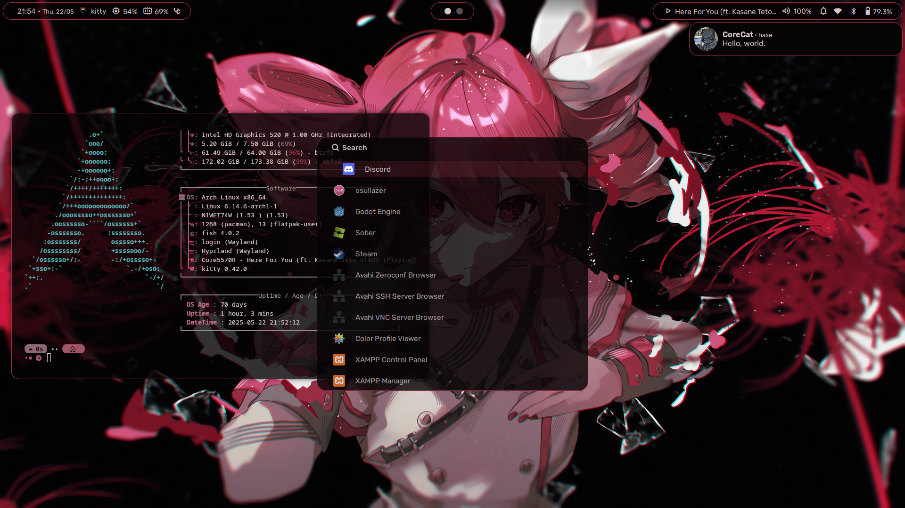
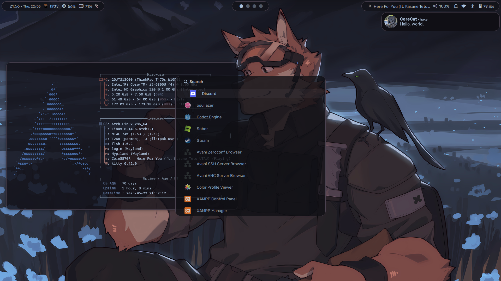
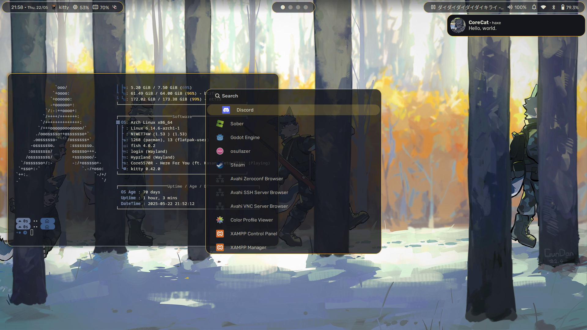

<h1 align=center style='font-family:monospace'>> CoreCat's Dotfiles <</h1>

Welcome to my personal dotfiles.  
I'm a newbie on making these stuff, so don't expect much :]

## 🖼️ Preview

The entire UI adapts automatically to your current wallpaper. Here are some examples:

| Red Theme | Grayish Blue | Yellow |
|-----------|---------------|--------|
|  |  |  |

## ⌨️ Keybinds
You can check the list [here](KEYBINDS.md)

## 🔧 Details

- **Window Manager**: Hyprland
- **Terminal**: kitty
- **Shell**: Fish
- **Notification**: Dunst
- **Bar**: Waybar
- **Launcher**: Wofi

## Notes
There's no step-by-step / installation script for this dotfiles, so you should figure it out by yourself if you want to try this out.

This dotfiles (mainly the hyprland ones) are inspired by [end-4 dotfiles](https://github.com/end-4/dotfiles).